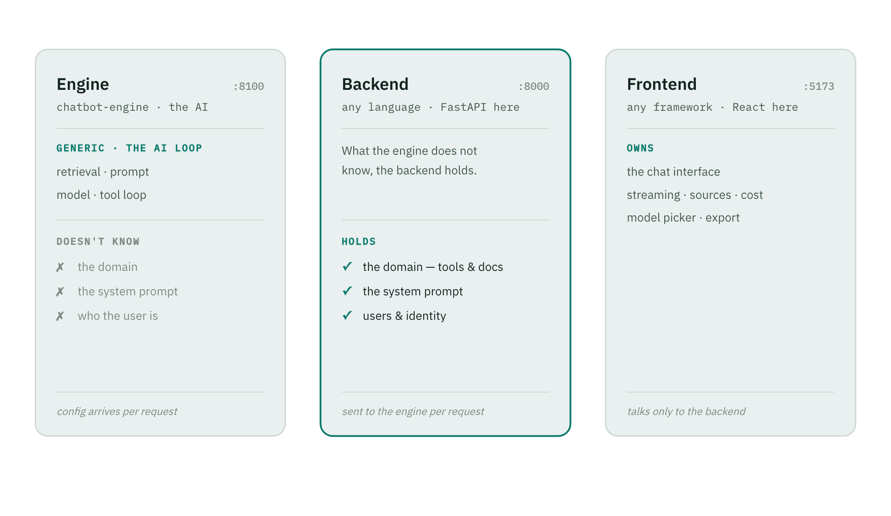
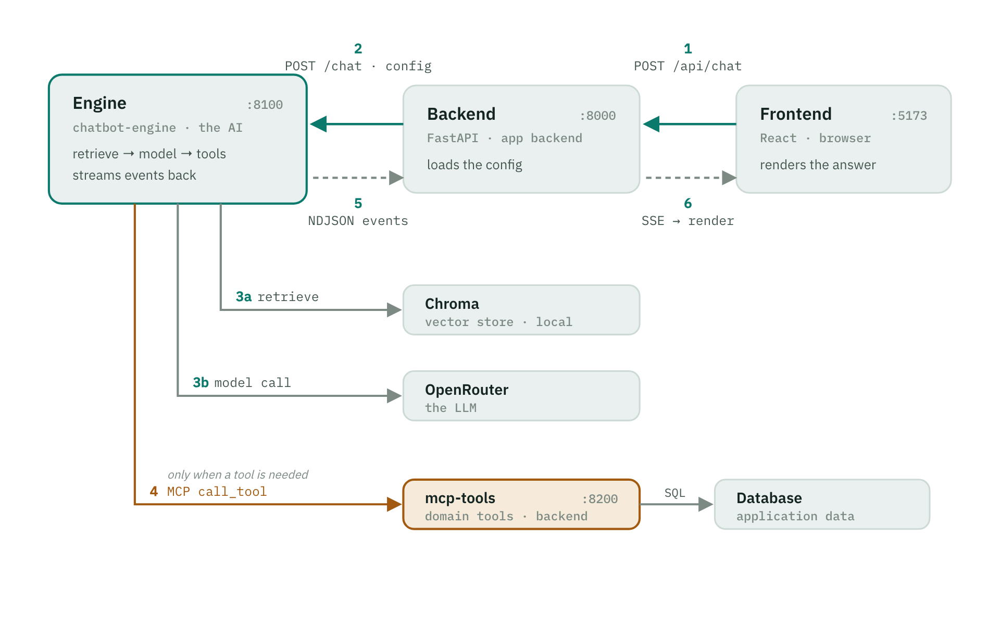

# A RAG chatbot engine with tool calling

A reusable engine for building domain-specific chatbots. It does the AI:
retrieval from a knowledge base, prompting, streaming the answer, and the loop
that calls tools and feeds their results back to the model. It knows nothing
about any particular product.

What makes a chatbot *yours* (the system prompt, the model, the tools, the
documents) is supplied by a backend you own, and arrives with **every request**.
So the engine holds no state to migrate, a prompt change takes effect on the next
request, and one engine can power many different assistants at once.

The repository includes a **complete example**, a travel-support assistant, to
show the engine working end to end: a React UI, a backend with its own database
and tools, and a knowledge base of support documents.

## What it does

- **Retrieval-augmented answers.** Documents are chunked and embedded, then
  searched per question.
- **Tool calling over MCP.** The model calls the backend's own tools when it
  needs live data; the engine only ever sees the tools a request allowlists.
- **Streaming.** The answer appears token by token, with tool activity and token
  cost shown as they happen.
- **Multi-model.** The model is chosen per request (OpenAI, Anthropic, Google,
  and more), all through OpenRouter.
- **Multi-language.** Ask in any language and the assistant replies in the same
  one, still grounded in the same knowledge base, since retrieval works across
  languages. This comes from the backend's system prompt, not the engine, since
  the backend owns the prompt.
- **Document ingestion.** Upload a file and the engine extracts, chunks, embeds,
  and stores it; re-uploading identical bytes is skipped by content hash.
- **Conversation export.** Download a transcript as JSON, CSV, or PDF.
- **Admin dashboard.** Inspect the application data and run the evaluation from
  the browser, behind a shared operator key (`BACKEND_ADMIN_KEY`).
- **Deployable.** Rate limits on the routes that cost money, one seam for real
  authentication, and a startup check that refuses to serve a production
  deployment with development defaults — see [DEPLOYMENT.md](DEPLOYMENT.md).
- **Evaluation.** An LLM-as-judge harness grades the assistant's behaviour
  against a rubric, and a RAGAS harness scores the retrieval (faithfulness,
  answer relevancy, context precision and recall).
- **Guardrails.** A tool allowlist, prompt-injection handling, and untrusted
  document and tool text treated as data, never as instructions.

## Architecture

Three services, each owning one thing. The engine is the fixed AI service; the
frontend and backend can be any stack, because everything crosses a plain
HTTP + JSON boundary.

<picture>
  <source media="(prefers-color-scheme: dark)" srcset="docs/images/architecture-dark.png" />
  
</picture>

- **Engine** (`:8100`) is the AI. It owns retrieval, prompt construction, the
  model call, and the tool loop. It holds no product configuration, since that
  arrives with every request. This is the reusable part.
- **Backend** (`:8000`) is the product. It owns users, the assistant
  configuration (prompt, model, tools), the documents API, and the domain tools.
  It owns no AI logic, and can be any language. *(The example is a travel-support
  app in FastAPI.)*
- **Frontend** (`:5173`) is the chat interface. It streams the answer, shows
  sources and cost, and talks only to the backend. Any UI framework.

> Connecting a backend to the engine (the endpoints, the request shape, reading
> the stream, exposing your tools over MCP) is written up separately in
> **[docs/backend-integration.md](docs/backend-integration.md)**.

## How a chat turn flows

A request runs right to left (browser to backend to engine); a stream of events
runs back to the screen. The engine reaches down to the vector store and the
model, and sideways over MCP only when the model needs live data.

<picture>
  <source media="(prefers-color-scheme: dark)" srcset="docs/images/chat-workflow-dark.png" />
  
</picture>

1. **Frontend to Backend.** The browser sends the message.
2. **Backend to Engine.** The backend loads its config and calls the engine.
3. **Engine to vector store and model.** Retrieve the nearest chunks, then stream
   the answer from the model.
4. **Engine to MCP to database.** If the model needs live data, it calls the
   backend's tool server, which queries the database.
5. **Engine to Backend.** Events stream back (sources, tokens, usage, done).
6. **Backend to Frontend.** Reframed as server-sent events; the UI paints tokens
   as they arrive.

## Running it

You need an [OpenRouter API key](https://openrouter.ai/keys) and either Docker
(easiest) or Python 3.13 plus Node plus a local Postgres.

### One-time setup

```bash
make setup          # install dependencies and create .env
```

Then put your key in `.env`:

```
ENGINE_OPENROUTER_API_KEY=sk-or-...
```

### The whole stack, in Docker

```bash
make up             # frontend, backend, engine, tools, and Postgres
make migrate        # create the tables
make seed-db        # load the example data
make seed           # load the knowledge base
```

Open **http://localhost:5173**.

### Or run it locally for development

```bash
make db && make migrate && make seed-db   # Postgres in Docker, seeded
make dev            # engine (:8100) and backend (:8000), with reload
make tools          # the MCP tool server (:8200)
make frontend       # the UI (:5173)
make seed           # load the knowledge base
```

Run `make` on its own to see every command.

## Trying the example

The included travel-support app answers from its knowledge base, or calls a tool
when you give it a booking reference:

- *What is the cabin baggage allowance?* answers from the documents, with a
  citation.
- *Is my flight delayed? My booking is AB12CD.* chains two tools.
- *Can I get a refund on a Basic fare?* gives a grounded policy answer.
- *Wie viel Handgepäck darf ich mitnehmen?* answers in German from the same
  English documents.

Switch the model from the dropdown, export the chat, or open the **Admin
dashboard** to view the data and run the evaluation.

## Deploying it

Everything above is set up for a laptop: every service is published to the host,
the database password is in the compose file, and nothing is authenticated.

For anything other people can reach, set both services to production —

```
BACKEND_ENV=production
ENGINE_ENV=production
```

— and they will refuse to start on a default that is only safe locally, naming
each variable to set, rather than serve with one. There is a compose overlay
that does the rest (unpublishes the internal ports, demands every secret):

```bash
docker compose -f docker-compose.yml -f docker-compose.prod.yml up -d
```

**[DEPLOYMENT.md](DEPLOYMENT.md)** is the full guide: secrets, the network
shape, TLS, rate limits, migrations — and an honest list of what is
authenticated and what is not, which is worth reading before you put this in
front of users.

## Evaluation

Two harnesses. Both run in the engine (only it holds the model credentials);
the backend just sends the dataset.

**System prompt.** A judge model grades the assistant's behaviour against a
rubric: does it refuse what it should, stay grounded, and never invent a policy?
Run it from the Admin dashboard, or the command line:

```bash
make eval                       # score the system prompt (needs the stack running)
make eval ARGS=--show           # re-read the last run, no model calls
```

**Retrieval (RAGAS).** Scores the search itself: is the answer grounded in the
retrieved context (faithfulness), does it address the question (answer
relevancy), and did retrieval find relevant, sufficient chunks (context
precision and recall)? Run it from the Admin dashboard, or the command line:

```bash
make eval-rag                        # score retrieval (needs the engine eval extra)
make eval-rag ARGS="--only follow_up"
```

## Project layout

```text
engine/     the standalone AI engine, the reusable part    -- see engine/README.md
backend/    the example product backend                    -- see backend/README.md
frontend/   the chat UI                                     -- see frontend/README.md
docs/       guides and diagrams
tests/      the contract-parity test, where the two services meet
```

## Documentation

- **[DEPLOYMENT.md](DEPLOYMENT.md)** covers running this where other people can
  reach it: secrets, the network shape, TLS, rate limits, and what is and is not
  authenticated.
- **[docs/backend-integration.md](docs/backend-integration.md)** shows how to
  connect a backend to the engine.
- **[engine/README.md](engine/README.md)**, **[backend/README.md](backend/README.md)**,
  and **[frontend/README.md](frontend/README.md)** cover each service in detail.

## Tests

```bash
make test           # Python (engine + backend) and the frontend suite
```
