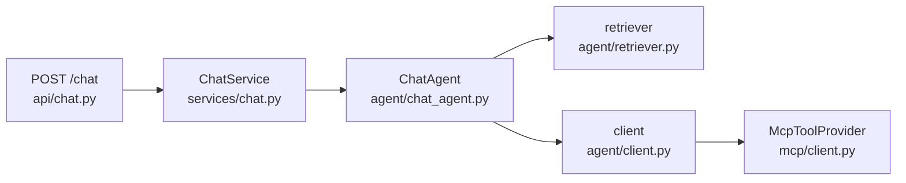
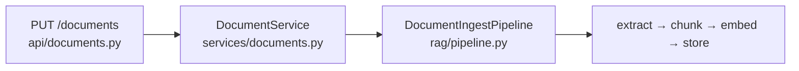

# Engine architecture

This document maps the engine's structure: the entry points, the layers a
request passes through, and the file responsible for each step. It is the
orientation the directory tree alone does not provide.

## Overview

The engine exposes four operations, each a direct path from an HTTP route to the
code that fulfils it:

| Operation | Route | Work |
| --- | --- | --- |
| Answer a chat turn | `POST /chat` | Retrieve context, call the model, run requested tools, stream the answer |
| Ingest a document | `PUT /documents` | Extract, chunk, embed, store |
| Grade the system prompt | `POST /judge` | Answer a dataset, score each answer against a rubric |
| Grade retrieval | `POST /eval/rag` | Answer a dataset, score retrieval with RAGAS |

There is no top-level branching. Tracing any one operation from its route to the
implementation reveals the shape of the whole engine.

## Ports and wiring

The engine depends on interfaces, not implementations. Each capability (calling
a model, searching vectors, reaching a tool server) is defined as a `Protocol`
in [`ports/`](../engine/src/chatbot_engine/ports) and consumed through that
protocol alone. The concrete class behind each port is selected in exactly one
place: [`api/dependencies.py`](../engine/src/chatbot_engine/api/dependencies.py).

This is what makes the engine reusable rather than a single application.
Replacing the model provider, the agent, or the tool protocol means writing a
new class and updating one `get_*()` factory; no caller changes.

`api/dependencies.py` is therefore the definitive index of what runs. It lists
every implementation on one screen:

| Port | Implementation | Location |
| --- | --- | --- |
| `Agent` | `AgentRouter`, over `ChatAgent` and any installed plugin | `agent/router.py` |
| `ToolProvider` | `McpToolProvider` | `mcp/client.py` |
| `IngestPipeline` | `DocumentIngestPipeline` | `rag/pipeline.py` |
| `DocumentRegistry` | `SqliteDocumentRegistry` | `documents/sqlite_registry.py` |
| `BlobStore` | `DocumentBlobs` | `documents/blobs.py` |
| `Judge` / `RagEvaluator` | functions in `eval/` | `eval/` |

## Chat request path



1. **`api/chat.py`** receives the request, checks the two preconditions that
   can still become a status code (a provider key, 501; a known agent name,
   422), then opens an NDJSON stream. Anything that fails after that point
   arrives inside the stream as an `error` event followed by `done`.
2. **`services/chat.py`** delegates to the agent. The layer exists so the route
   depends on one object rather than on the agent's construction, and so a test
   can hand the route any agent. It contains no logic.
3. **`agent/router.py`** picks the agent the assistant config asked for, then
   delegates. Both agents emit the same events, so nothing downstream changes.
4. **`agent/chat_agent.py`** is the only agent the engine ships: it runs the
   turn (retrieve, emit sources, stream the answer, emit `done`) and translates
   raw model output into typed events. Any other agent, including the bundled
   LangGraph one, is an installed plugin. See [agents.md](agents.md).
5. **`agent/retriever.py`** performs retrieval: rewrite the query, search the
   vector store and, under `hybrid`, the keyword index in `rag/sparse.py`,
   fuse the rankings, rerank with the model when enabled, and return the hits
   and the numbered context. See [retrieval.md](retrieval.md).
6. **`agent/client.py`** runs the model-and-tool loop: discover the MCP tools,
   call the model, execute any requested tool through the `ToolProvider`, return
   the result to the model, and repeat until it produces a final answer. This is
   the densest file in the engine, reflecting the inherent complexity of the tool
   loop.

## Document ingestion path



The structure mirrors the chat path: a route, a thin service, and a pipeline
that performs the work behind ports.
Storage fans out to three of them: `ChromaChunkStore` for vectors,
`DocumentBlobs` for the original file, and `SqliteDocumentRegistry` for the
record.

How the document is cut before embedding is configurable per project. See
`rag/splitter.py`, described in [chunking.md](chunking.md).

## Directory reference

```text
api/          HTTP surface: routes, auth, rate limits, streaming, and
              dependencies.py, the record of what is wired to what
ports/        the interfaces every other module depends on
agent/        the chat turn: router (which agent), registry (which exist),
              chat_agent (the built-in), retriever (RAG), client (model loop)
rag/          vectors, the keyword index, fusion and reranking, chunking,
              embeddings, the ingest pipeline
mcp/          the MCP client that reaches the application's tools
documents/    document bookkeeping: the registry and the stored originals
models/       the request, response, and event schemas (the wire contract);
              workflow.py is the graph-of-steps schema the workflow agent runs
services/     thin boundaries between the routes and the ports
observability.py  the request id, the per-turn log line, and the metrics
tracing.py    LangSmith or Langfuse on every model call, per engine or per assistant
eval/         the two graders: the system-prompt judge and RAGAS retrieval
settings.py   every ENGINE_* option, with its default declared inline
```

## Reference points

- **Locating an implementation**: `api/dependencies.py` names the class; the
  port table above gives its file.
- **The wire contract**: `models/` defines everything a caller may send or
  receive. No other module defines request or response shapes.
- **The `services/` layer**: holds no business logic. Each service exists so a
  route depends on one object, and so a test can substitute it.
- **Readiness**: `GET /health/ready` reports whether a provider key is set,
  whether the vector store answers, and which agents are installed. Without a
  key the engine still records and chunks documents, and answers 501 to
  anything that needs a model.
- **One process or several**: embedded Chroma and in-memory rate-limit buckets
  belong to one process. `ENGINE_CHROMA_URL` and `ENGINE_REDIS_URL` move each
  to a shared service; see `DEPLOYMENT.md`, "Scaling out".
- **Caller context**: a tool call carries `X-User-Id` and `X-Session-Id`, the
  caller's own identifiers, forwarded untouched. The engine attaches no meaning
  to either; a tool server needs them to scope what it reads and writes, and the
  model must never supply them.
- **State**: the engine holds none of the caller's configuration. The system
  prompt, model, tools, and documents arrive with each request, so a request can
  be reasoned about in isolation.
