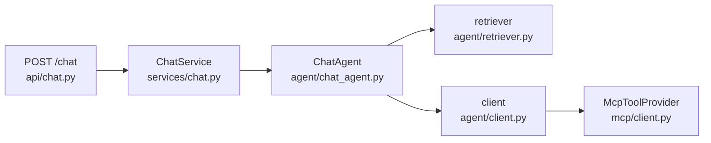
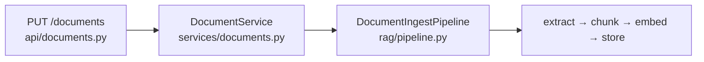

# Engine architecture

This document maps the engine's structure: the entry points, the layers a
request passes through, and the file responsible for each step. It is the
orientation the directory tree alone does not provide.

## Overview

The engine exposes four operations, each a direct path from an HTTP route to the
code that fulfils it:

| Operation | Route | Work |
| --- | --- | --- |
| Answer a chat turn | `POST /chat` | Retrieve context, call the model, run requested tools, stream the answer |
| Ingest a document | `PUT /documents` | Extract, chunk, embed, store |
| Grade the system prompt | `POST /judge` | Answer a dataset, score each answer against a rubric |
| Grade retrieval | `POST /eval/rag` | Answer a dataset, score retrieval with RAGAS |

There is no top-level branching. Tracing any one operation from its route to the
implementation reveals the shape of the whole engine.

## Ports and wiring

The engine depends on interfaces, not implementations. Each capability — calling
a model, searching vectors, reaching a tool server — is defined as a `Protocol`
in [`ports/`](../engine/src/chatbot_engine/ports) and consumed through that
protocol alone. The concrete class behind each port is selected in exactly one
place: [`api/dependencies.py`](../engine/src/chatbot_engine/api/dependencies.py).

This is what makes the engine reusable rather than a single application.
Replacing the model provider, the agent, or the tool protocol means writing a
new class and updating one `get_*()` factory; no caller changes.

`api/dependencies.py` is therefore the definitive index of what runs. It lists
every implementation on one screen:

| Port | Implementation | Location |
| --- | --- | --- |
| `Agent` | `ChatAgent` | `agent/chat_agent.py` |
| `ToolProvider` | `McpToolProvider` | `mcp/client.py` |
| `IngestPipeline` | `DocumentIngestPipeline` | `rag/pipeline.py` |
| `DocumentRegistry` | `SqliteDocumentRegistry` | `documents/sqlite_registry.py` |
| `BlobStore` | `DocumentBlobs` | `documents/blobs.py` |
| `Judge` / `RagEvaluator` | functions in `Eval/` | `Eval/` |

`documents/registry.py` contains a second, in-memory registry used only by the
test suite. It is not wired into the running engine and can be disregarded when
tracing the request path.

## Chat request path



1. **`api/chat.py`** receives the request, delegates to the chat service, and
   opens an NDJSON stream. The response status is resolved before the body is
   sent, so a failure returns a correct 501 rather than an empty `200` with the
   error inside the stream.
2. **`services/chat.py`** enforces one precondition: if no `Agent` is registered,
   it raises 501; otherwise it delegates. The layer exists so that `/chat` and
   `/documents` report a missing implementation uniformly. It contains no other
   logic.
3. **`agent/chat_agent.py`** runs the turn — retrieve, emit sources, stream the
   answer, emit `done` — and translates raw model output into typed events.
4. **`agent/retriever.py`** performs retrieval: rewrite the query, search the
   vector store, return the hits and the numbered context.
5. **`agent/client.py`** runs the model-and-tool loop: discover the MCP tools,
   call the model, execute any requested tool through the `ToolProvider`, return
   the result to the model, and repeat until it produces a final answer. This is
   the densest file in the engine, reflecting the inherent complexity of the tool
   loop.

## Document ingestion path



The structure mirrors the chat path: a route, a service that verifies its
dependencies are wired, and a pipeline that performs the work behind ports.
Storage fans out to three of them — `ChromaChunkStore` for vectors,
`DocumentBlobs` for the original file, and `SqliteDocumentRegistry` for the
record.

## Directory reference

```text
api/          HTTP surface: routes, auth, rate limits, streaming, and
              dependencies.py — the record of what is wired to what
ports/        the interfaces every other module depends on
agent/        the chat turn: chat_agent (orchestration), retriever (RAG),
              client (the model and tool loop)
rag/          vectors, chunking, embeddings, the ingest pipeline
mcp/          the MCP client that reaches the application's tools
documents/    document bookkeeping: the registry and the stored originals
models/       the request, response, and event schemas — the wire contract
services/     readiness boundaries between the routes and the ports
Eval/         the two graders: the system-prompt judge and RAGAS retrieval
settings.py   every ENGINE_* option, with its default declared inline
```

## Reference points

- **Locating an implementation** — `api/dependencies.py` names the class; the
  port table above gives its file.
- **The wire contract** — `models/` defines everything a caller may send or
  receive. No other module defines request or response shapes.
- **The `services/` layer** — a readiness guard by design. It holds no business
  logic; the work is behind the port it delegates to.
- **State** — the engine holds none of the caller's configuration. The system
  prompt, model, tools, and documents arrive with each request, so a request can
  be reasoned about in isolation.
